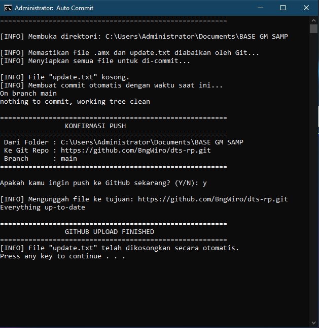

# Project Manager & Auto Git Updater
**By BngWiro**

Script Batch (`.bat`) serbaguna untuk mempermudah pengelolaan file project dan mempercepat *workflow* kamu. Tool ini sangat cocok untuk mengotomatiskan *version control* (upload ke GitHub) untuk semua file di dalam folder secara sekaligus, sekaligus menyediakan pintasan untuk kompilasi dan *testing*.



---

## Fitur Utama

* **Auto Commit & Push (All Files):** Mengotomatiskan perintah Git (`git add`, `git commit`, `git push`) untuk seluruh file project kamu hanya dengan satu ketikan.
* **Smart Multi-line Commit (`update.txt`):** * Pisahkan setiap fitur/bugfix ke dalam baris baru di `update.txt`, dan sistem akan otomatis mengubahnya menjadi riwayat commit terpisah di GitHub!
    * **Auto-Date System:** Jika kamu sedang buru-buru dan file `update.txt` kosong, script otomatis membuat commit menggunakan format tanggal dan jam saat ini (contoh: `Update - Fri 06/19/2026 13:00:00`).
* **Auto Git-Ignore:** Script ini cerdas! Mencegah file *compiled* (seperti `.amx`) dan `update.txt` ter-upload ke repository publik agar GitHub kamu tetap bersih dan rapi.

---

## Persyaratan (Prerequisites)

Sebelum menggunakan tool ini, pastikan sistem kamu sudah memenuhi syarat berikut:
1.  [Git for Windows](https://git-scm.com/downloads) telah terinstall dan sudah terhubung dengan akun GitHub kamu.
2.  Pastikan nama folder dan path di dalam script sudah sesuai dengan lokasi project kamu.

---

## Cara Penggunaan & Konfigurasi

1. Buka file `.bat` (misalnya `commit.bat` atau `Manager.bat`) menggunakan Notepad atau text editor lainnya.
2. Sesuaikan konfigurasi direktori dan repository di bagian atas script:
   ```bat
   set REPO_URL=[https://github.com/UsernameKamu/nama-repo.git](https://github.com/UsernameKamu/nama-repo.git)
   set BRANCH=main
   set ROOT_DIR=C:\Users\...\FolderProjectKamu
